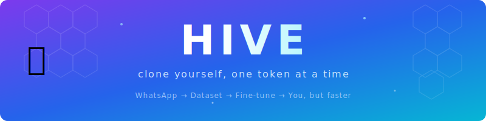
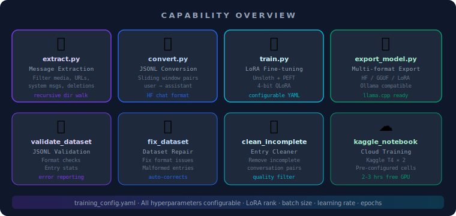
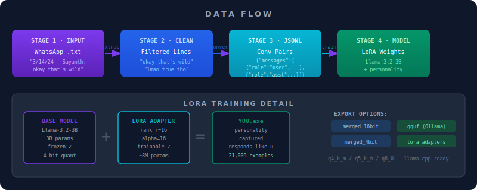
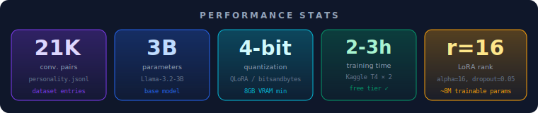

<div align="center">



</div>

---

## What is this? 🤔

You know that moment when someone texts you and you think *"I could train an LLM on my entire messaging history and it would reply better than me"*? That's not a joke. That's this project.

**Hive** is a pipeline that takes your WhatsApp chat exports, filters out all the noise (deleted messages, `<Media omitted>`, your ex's entire paragraph), and transforms what's left into a fine-tuning dataset for LLMs. The end goal: a language model that sounds exactly like you. For better or worse.

You feed it your chats. It feeds a 3B-parameter model 21,000+ examples of how you talk. Then you get a mini-you that never sleeps, never says "lol" unironically, and answers every question in your exact flavor of chaotic energy.

---

<div align="center">

[](https://python.org)
[](https://pytorch.org)
[](https://huggingface.co/docs/transformers)
[](https://github.com/unslothai/unsloth)
[](https://github.com/huggingface/peft)
[](LICENSE)
[](https://kaggle.com)
[](https://colab.research.google.com)

</div>

---

## 🎬 In Action

> **Place demo GIF here: `assets/demo.gif`**


*The GIF should show:*
- *Running `python extract.py` and watching it filter your messages in real-time*
- *`python convert.py` outputting the JSONL pairs*
- *`python train.py` showing the training loss curve and tqdm progress*
- *A quick terminal session with the exported model replying in your style*

*(Until you record it, imagine a terminal going brrrr while loss curves drop. Very satisfying. Very nerdy. Very you.)*

---

## 🧠 System Overview

At its core, Hive is a **four-stage data-to-model pipeline**:

| Stage | Script | What it does |
|-------|--------|--------------|
| 1. Extract | `extract.py` | Parses WhatsApp `.txt` exports, keeps only your messages, strips URLs / system messages / media |
| 2. Convert | `convert.py` | Slides a window over your cleaned messages to create `user → assistant` conversational pairs in JSONL |
| 3. Train | `train.py` | Fine-tunes `Llama-3.2-3B-Instruct` using LoRA + 4-bit QLoRA via Unsloth. Fully config-driven. |
| 4. Export | `export_model.py` | Ships your trained model as HuggingFace weights, GGUF for Ollama/llama.cpp, or raw LoRA adapters |

Three utility scripts keep your data honest: `validate_dataset.py`, `fix_dataset.py`, and `clean_incomplete.py`. One cloud-ready notebook (`kaggle_training_notebook.py`) means you can train for free on Kaggle in 2-3 hours.

---

## ✨ Features

- 🧹 **Smart message extraction** — filters deleted msgs, `<Media omitted>`, URLs, system messages, handles recursive multi-chat directories
- 🔄 **Automatic JSONL conversion** — sliding-window pair generation, HuggingFace chat template format
- 🚀 **4-bit QLoRA fine-tuning** — memory-efficient training via Unsloth + bitsandbytes, runs on 8GB VRAM
- 📦 **Multi-format export** — `merged_16bit`, `merged_4bit`, `gguf` (q4_k_m / q5_k_m / q8_0), raw LoRA adapters
- ☁️ **Cloud-ready** — pre-configured for Kaggle T4×2 (2-3 hrs), Colab T4 (3-4 hrs), RunPod RTX 4090 (45-90 min)
- ⚙️ **YAML-driven config** — all hyperparameters in `training_config.yaml`, swap models in one line
- ✅ **Dataset validation** — JSONL integrity checks, error reporting, entry statistics
- 🔧 **Dataset repair tools** — `fix_dataset.py` and `clean_incomplete.py` handle malformed entries
- 🎯 **FP16/BF16 auto-detect** — runtime precision fallback based on GPU capability

---

## 🗺️ Capability Overview

<div align="center">



</div>

---

## 🏗️ Architecture

<div align="center">


</div>

---

## 🌊 Data Flow

<div align="center">



</div>

---

## ⚡ Installation

### Prerequisites

- Python 3.10 or 3.11
- CUDA-capable GPU (8GB+ VRAM) *or* free Kaggle/Colab account
- Your WhatsApp chat exports (exported as `.txt` without media)

### Local Setup

```bash
# Clone the repo
git clone https://github.com/Kaelith69/Hive.git
cd Hive

# Create a virtual environment (don't skip this, you know what happens)
python -m venv venv
source venv/bin/activate  # Windows: venv\Scripts\activate

# Install core dependencies
pip install -r requirements.txt

# Install Unsloth (choose the right variant for your setup)
# For Google Colab:
pip install "unsloth[colab-new] @ git+https://github.com/unslothai/unsloth.git"

# For local CUDA 12.1 + PyTorch 2.3:
pip install "unsloth[cu121-torch230] @ git+https://github.com/unslothai/unsloth.git"
```

### Windows Setup (PowerShell)

```powershell
# A setup script is included
.\setup.ps1
```

### Cloud Setup (Kaggle — Free T4×2 GPU)

1. Upload your `dataset/final/personality.jsonl` as a Kaggle dataset
2. Copy the cells from `KAGGLE_CELL.txt` into a new notebook
3. Or use the full `kaggle_training_notebook.py`
4. Enable GPU → `Settings → Accelerator → GPU T4 x2`
5. Hit run. Go make coffee. Come back in 2-3 hours.

See `KAGGLE_SETUP.md` and `CLOUD_TRAINING.md` for full cloud platform guides.

---

## 🚀 Usage

### Step 1 — Prepare Your Data

Export your WhatsApp chats as `.txt` files (without media). Drop them in `dataset/raw/`. They can be in subdirectories — `extract.py` walks recursively.

```bash
# Set YOUR_NAME in extract.py to your WhatsApp display name first
# Then:
python extract.py
```

This writes your cleaned messages to `dataset/cleaned/`.

### Step 2 — Convert to JSONL

```bash
python convert.py
```

Creates `dataset/final/personality.jsonl` with 21,000+ conversational pairs.

**Validate your dataset:**

```bash
python validate_dataset.py
```

**If something looks broken:**

```bash
python fix_dataset.py
python clean_incomplete.py
```

### Step 3 — Configure Training

Edit `training_config.yaml` to your needs:

```yaml
model:
  base_model: "unsloth/Llama-3.2-3B-Instruct"  # or Qwen2.5, Phi-4, Mistral-7B

lora:
  r: 16          # Higher = more capacity, slower training
  lora_alpha: 16

training:
  num_train_epochs: 2
  learning_rate: 3.0e-4
  per_device_train_batch_size: 4
```

### Step 4 — Train

```bash
python train.py
# Resume from checkpoint:
python train.py --resume outputs/checkpoint-500
```

Training saves checkpoints to `outputs/`. Final model lands in `outputs/final_model`.

### Step 5 — Export

```bash
# Export as GGUF (for Ollama / llama.cpp)
python export_model.py --input outputs/final_model --type gguf --name hive-personality

# Export as merged 16-bit HuggingFace model
python export_model.py --input outputs/final_model --type merged_16bit

# Export all formats
python export_model.py --input outputs/final_model --type all
```

**Run with Ollama:**

```bash
# Create a Modelfile
echo "FROM ./exports/hive-personality.gguf/hive-personality-Q4_K_M.gguf" > Modelfile
ollama create hive-personality -f Modelfile
ollama run hive-personality
```

---

## 📁 Project Structure

```
Hive/
├── assets/                          # Documentation assets
│   ├── banner.svg
│   ├── architecture.svg
│   ├── dataflow.svg
│   ├── capabilities.svg
│   ├── stats.svg
│   └── demo.gif                     # ← put your demo GIF here
│
├── dataset/
│   ├── raw/                         # Your WhatsApp .txt exports (don't commit these)
│   ├── cleaned/                     # Extracted messages (your words only)
│   └── final/
│       └── personality.jsonl        # The crown jewel: 21,009 conv pairs
│
├── wiki/                            # GitHub wiki documentation
│   ├── Home.md
│   ├── Architecture.md
│   ├── Installation.md
│   ├── Usage.md
│   ├── Privacy.md
│   ├── Troubleshooting.md
│   ├── Roadmap.md
│   └── DataSpecs.md
│
├── outputs/                         # Training checkpoints (gitignored)
├── exports/                         # Exported models (gitignored)
│
├── extract.py                       # Stage 1: message extraction
├── convert.py                       # Stage 2: JSONL conversion
├── train.py                         # Stage 3: LoRA fine-tuning
├── export_model.py                  # Stage 4: model export
├── validate_dataset.py              # Dataset integrity checker
├── clean_incomplete.py              # Remove incomplete entries
├── fix_dataset.py                   # Repair malformed entries
├── kaggle_training_notebook.py      # Cloud training notebook
│
├── training_config.yaml             # All hyperparameters live here
├── requirements.txt                 # Python dependencies
├── setup.ps1                        # Windows PowerShell setup
│
├── TRAINING_GUIDE.md                # Full hardware/software guide
├── CLOUD_TRAINING.md                # Colab, Kaggle, RunPod setup
├── FAST_TRAINING.md                 # Speed optimization notes
└── KAGGLE_SETUP.md                  # Kaggle-specific instructions
```

---

## 📊 Performance Stats

<div align="center">



</div>

| Platform | Hardware | Est. Time |
|----------|----------|-----------|
| Kaggle (free) | T4 × 2 | 2–3 hours |
| Colab Free | T4 | 3–4 hours |
| Colab Pro | V100 | 1–2 hours |
| RunPod | RTX 4090 | 45–90 min |
| Local | RTX 3060 (12GB) | ~4–5 hours |

*Effective batch size = 16 (batch 4 × grad accum 4). Only ~8M of the 3B params are actually trained (that's the LoRA magic).*

---

## 🔒 Privacy

**Your chat data is yours. Full stop.**

- `dataset/raw/` and `dataset/cleaned/` are gitignored by default
- `personality.jsonl` may contain personal content — review before committing publicly
- Model weights are gitignored (`.gguf`, `.safetensors`, `.bin`)
- No data is sent anywhere — training runs locally or on your chosen cloud account
- Wandb / TensorBoard logging is disabled by default (`report_to: "none"`)

**Before making this repo public:**
1. Delete or anonymize `dataset/raw/` and `dataset/cleaned/`
2. Review `dataset/final/personality.jsonl` for anything you wouldn't tweet
3. Make sure `exports/` is empty or excluded

See [wiki/Privacy.md](wiki/Privacy.md) for the full paranoia checklist.

---

## 🔮 Future Roadmap

- [ ] **Multi-person dataset support** — fine-tune on multiple people's styles simultaneously
- [ ] **Automatic chat partner detection** — no more hardcoding `YOUR_NAME`
- [ ] **Quality filtering** — remove low-quality/short messages automatically
- [ ] **Merge tool** — combine multiple chat exports into one clean dataset
- [ ] **Interactive inference script** — chat with your trained model in the terminal
- [ ] **HuggingFace Hub auto-push** — one-command upload after training
- [ ] **Model evaluation metrics** — BLEU/ROUGE scores on held-out validation set
- [ ] **Web UI** — because typing commands is for people who enjoy suffering

---

## 📜 License

MIT — see [LICENSE](LICENSE) for details.

Built with questionable judgment and an ungodly amount of text messages. 🐝