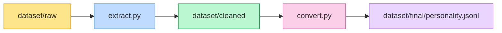
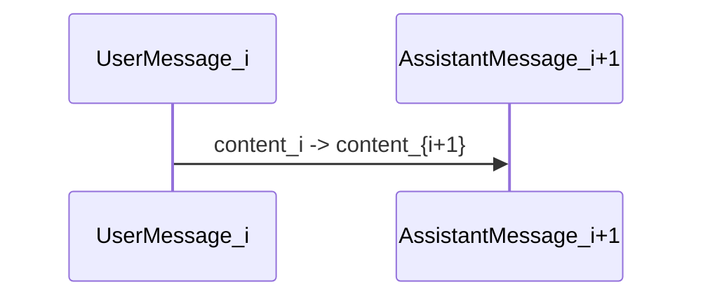

# REPORT — Hive Dataset (The Friendly, Slightly-Sassy Edition)

:coffee: Summary

This repo converts WhatsApp exports into a JSONL dataset suitable for fine-tuning conversational assistants. It's messy, colloquial, sometimes spicy, and delightfully human — perfect if you want a model with personality.

**Pipeline overview (simple, visual)**



Note: colors are for your eyes (and morale).

What I cleaned and why (specs)

- Removed system messages that are non-content: `You deleted this message`, `<Media omitted>`.
- Stripped all URLs (http/https/www) — external links don't teach personality.
- Kept messages only where the `name == YOUR_NAME` (i.e., your lines).
- Skipped empty lines or messages that become empty after URL removal.

Why this encoding?

Fine-tuning expects (for many frameworks) short conversational turns. We encode consecutive messages as user→assistant pairs:

```
{"messages": [
  {"role": "user", "content": "first line"},
  {"role": "assistant", "content": "second line"}
]}
```

So each adjacent pair of your messages becomes a micro-conversation; it's simple and effective.

Data quality & counts

- Cleaned messages ~21,011
- Final JSONL entries: 21,009 — above the 20k ideal threshold. 🎯

Sample entries (real, unfiltered-for-fun examples)

```jsonl
{"messages": [{"role":"user","content":"I might actually be Asexual"},{"role":"assistant","content":"Yeah"}]}
{"messages": [{"role":"user","content":"Where"},{"role":"assistant","content":"Distance ind"}]}
```

This matches the voice — short, casual, mixing English and Malayalam.

Further improvements you might want

- Remove extremely short tokens ("Aa", "No") — these don't teach much.
- Normalize emoji or replace with textual labels (":smile:").
- Anonymize emails/phone numbers.
- Split long messages into multiple training turns, or chunk long texts into smaller samples.

Funny bits (because life is short)

- If your dataset had a mood: it would be "Chai + Tech + Car Talk".
- Training a model on this may enable it to say: "Enikk exam ind June 14 th vare — study or die trying." (not recommended)

Schema / Spec (machine-friendly)

- Input: WhatsApp plain text export(s) with lines like `12/03/24, 10:32 pm - Friend: hello`
- Extraction regex: `.* - (.*?): (.*)` (capturing name and message)
- Filters: remove system/media, strip URLs
- Output: JSONL where each line is a JSON object with `messages` array of two objects: `user` and `assistant`.

Mermaid sequence (conversation encoding):



How to reproduce locally

```powershell
# set name inside extract.py
python extract.py
python convert.py
# verify
(Get-Content .\dataset\final\personality.jsonl | Measure-Object -Line).Lines
```

Publishing guide

- Add remote, commit, and push. See `README.md` for commands.
- For the wiki: clone `<repo>.wiki.git` and copy files from `/wiki`.

Credits & disclaimers

- This tool is a convenience utility — you are responsible for removing sensitive data.
- Use for private/fine-tuning experiments; don't publish private content publicly.

End of REPORT — go train a sassy bot. Or a polite one. Or both. 🎭
